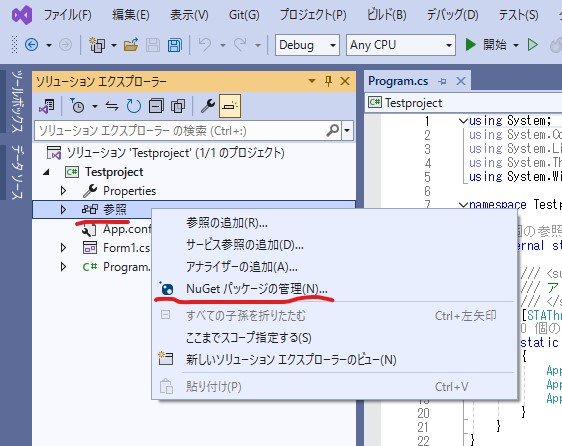

# VisualStudioで最低限使えるようにする
## プロジェクトの作成

新しいプロジェクトを作成をクリックしてください。

「Windowsフォームアプリケーション(.NET Framework)」というプロジェクトを選択し、次へを押します。

プロジェクト名にお好みのプロジェクト名を入れてください。最初の1文字目は英語大文字が望ましいです
そうしたら「ソリューションとプロジェクトを同じディレクトリに配置する」を選択してください。

:::info
プロジェクトの中に複数のソリューションを置くことができるのでこのように分けられていますが、正直無駄にフォルダマトリョーシカ化が加速するので推奨しません。
:::

これらを確認して「作成」をクリックしてください。
そうしたらしばらく待つとプロジェクトが作成されます

## ※毎回やる作業 NuGetパッケージをインストールする

「参照」から「NuGetパッケージの管理」を選択してください。

### MySQL.Dataを入れる
MySQL.DataはMySQLServerとコネクションをちょちょいのちょいでやってくれる便利な外部パッケージです。

上の検索窓に「MySQL.Data」と入力し、出てくるおなじみのMySQLのロゴのパッケージをクリックし、「インストール」ボタンをクリックしてください。

そのパッケージを動かすのにいるパッケージ一覧です。「適用」を押してください。

同意するを押してください。そうすると必要なパッケージを追加してくれます。

### BCrypt.Net-Nextを入れる
BCryptはとりあえず使っとけな優秀なハッシュ化ライブラリです。eclipseでもお世話になった。これからも使うでしょう。

先ほどと同じように参照から検索窓に「BCrypt」と入力してください。BCyの時点で有名なライブラリなので出てきます。出てくる「BCrypt.Net-Next」をクリックして、「インストール」を押します。

同意するを押してください。そうすると必要なパッケージを追加してくれます。

## GitHubへのデータのバックアップ
万が一うっかりデータが吹き飛ぶのを防止するために、また、複数機能の開発をブランチごとに管理できるようにGitを用いてバージョン管理をしましょう

「Git変更」から「Gitリポジトリの作成」を選択します。

「アカウント」は複数アカウントを登録できます。「所有者」は個人のアカウントだけではなく、組織のものを選択することも可能です。「リポジトリ名」には英語でお好みのわかりやすいリポジトリ名を入れてください。必要な項目を埋めたら、「作成とプッシュ」をクリックしてください。

VisualStudio上でGitの操作はできますが自分はGitGraphを見たいのでVSCodeで開いてコミットやプルリクエストも行っています。