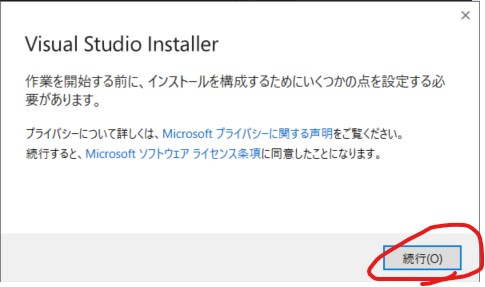

# VisualStudio 2022 Communityのセットアップ
今回はVisualStudioを使って開発を行います。絶妙にファイルサイズが大きいです。余裕をもって見積もってもだいたい16GBくらい持ってかれます。
## VisualStudoのインストーラーをダウンロードする
[VisualStudio 2022ダウンロードページ](https://visualstudio.microsoft.com/ja/downloads/)にアクセスするとこういう感じのページが開きます。

そうしたらコミュニティの無料ダウンロードボタンを押してください。
ダウンロードフォルダにVisualStudioのセットアップexeがあれば成功です

## VisualStudio 2022 Communityをインストールする
### インストーラーをインストールする
VisualStudioはVisualStudoのインストーラーをインストールしてからインストールするものです。なので先ほどダウンロードしたVisualStudoSetup.exeを開きます。
#### ダブルクリックしてインストーラーを開く

最初にダブルクリックしてインストーラーを開きます。そうするとよくわからんダイヤログが出てくるので続行してください。

このような画面が出てくるので待機してください
#### .NETデスクトップ開発用のワークロードをインストールする

見ての通り7.1GBしっかり持っていかれます。必要になれば後で追加もできるのでこの状態でインストールをします。チェックが入っているのを確認したら、「インストール」を押してください

結構待たされるので今のうちにコーヒーでも飲んでください。「インストール後に起動する」と書かれたチェックボックスにチェックがデフォルトで入っているのでインストール終わったら勝手に起動します。

#### インストール完了

筆者は再インストールした環境なのでゴリゴリにファイル残ってますが、インストール終わるとこんな雰囲気のウインドウが開きます。MySQLWorkBenchのインストールは18回大会環境を参照してください。

VisualStudioが開き次第タスクバーにピン止めしておくと幸せになれます