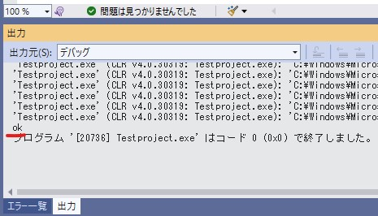

# MySQLServer側とアプリケーションの接続確認を行う
まずデータベースとコネクションを取らないことにはお話にならないので、とりあえず接続の確認をしましょう
下に添付するコードを「Proglam.cs」にコピペしてください

``` Csharp
using System;
using MySql.Data.MySqlClient;

namespace Testproject
{
    internal static class Program
    {
        /// <summary>
        /// アプリケーションのメイン エントリ ポイントです。
        /// </summary>
        [STAThread]
        static void Main()
        {
            // MySQLデータベースへの接続文字列 
            string connectionString = "server=localhost;database=mydatabase;user=root;password=myPassword;";
            // MySqlConnectionオブジェクトの作成
            MySqlConnection connection = new MySqlConnection(connectionString);

            try
            {
                // データベース接続を開く
                connection.Open();
                // 接続が成功した場合、"ok"と出力
                Console.WriteLine("ok");
            }
            catch (Exception)
            {
                // 接続が失敗した場合、"no"と出力
                Console.WriteLine("no");
            }
            finally
            {
                // 接続が開かれている場合、接続を閉じる
                if (connection.State == System.Data.ConnectionState.Open)
                {
                    connection.Close();
                }
            }
        }
    }
}

```
## 注意点
``` Csharp
// MySQLデータベースへの接続文字列 
string connectionString = "server=localhost;database=mydatabase;user=root;password=myPassword;";
```
ここの部分ですが、serverはMySQLServerがある場所、databaseはMySQLWorkBenchでのスキーマ、userはユーザーネーム、passwordはユーザーのパスワードを入れる部分です。あなたの環境に合わせて変更してください。


このように「ok」と表示されれば成功