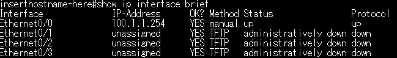

# NAT構築時の確認用コマンド

## インターフェースが生きてるかどうか確認する

```bash
show ip interface brief
```



見るべき項目は`IP-Address`と`Protocol`で、`IP-Address`が`unassigned`だったらIPアドレスが設定できません。`Protocol`が`up`になっていないなら`no shutdown`が通ってないです。通してください。

## NAT設定
NATの設定を確認します

```bash
show ip nat translations
```

## NATのエントリを削除して再設定
NATの設定を削除して再設定します

```bash
no ip nat inside source static  <inside-local> <inside-global>
ip nat inside source static <inside-local> <inside-global>
```

| 項目              | 値           | 説明               |
| --------------- | ----------- | ---------------- |
| `inside-local`  | 192.168.1.1 | 実際の機器のアドレス（LAN側） |
| `inside-global` | 100.1.1.10  | 外部に見せるアドレス（WAN側） |

