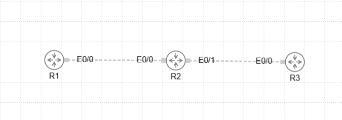

# はじめに
Static Natの構築について触れていきます

## Static Natとは?

## 設定方法

###　前提条件



| ノード | インターフェース | 役割     | IPアドレス         |
| --- | -------- | ------ | -------------- |
| R1  | Eth0/0   | 内部LAN側 | 192.168.1.1/24 |
| R2  | Eth0/0   | 内部LAN側 | 192.168.1.2/24 |
| R2  | Eth0/1   | 外部WAN側 | 100.1.1.1/24 |
| R3  | Eth0/0   | 外部サーバー | 100.1.1.254/24 |

- インターフェースは無料版だとGi0/0とかにリネームできないことが判明したためイーサネットじゃないけどEthを採用する羽目になりました。かなしい

## IPの設定
### R1、R3の初期設定

```bash
; R1ルーターのIPアドレスを指定
enable
configure terminal
interface eth0/0
 ip address 192.168.1.1 255.255.255.0 ;
 no shutdown
exit

; デフォルトゲートウェイの設定
ip route 0.0.0.0 0.0.0.0 192.168.1.2

```

```bash
; R3ルーターのIPアドレスを指定
enable
configure terminal
interface eth0/0
 ip address 100.1.1.254 255.255.255.0 ;
 no shutdown
exit

```


### R2ルーターにIPv4のアドレスを指定

```bash
; R2ルーターにインターフェースのIPアドレスを指定
; ついでにnatの設定もする

enable
configure terminal

; eth0/0側の設定
interface eth0/0
 ip address 192.168.1.254 255.255.255.0
 no shutdown
 ip nat inside
exit

; eth0/1側の設定
interface eth0/1
 ip address 100.1.1.1 255.255.255.0
 no shutdown
 ip nat outside
 exit

no ip htto server
no ip http secure-server

ip nat inside source static 192.168.1.1  100.1.1.1

```

