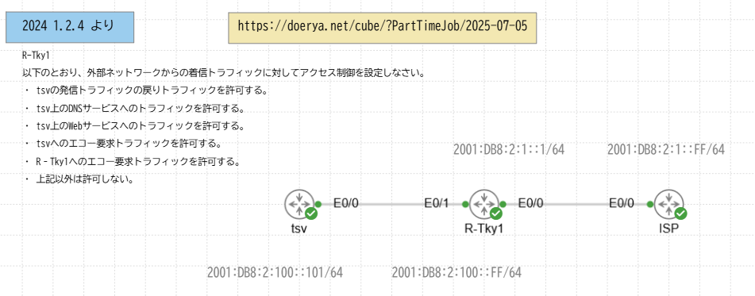

# establishを使ってv6のACLを組む

## 状況説明


- R-tkyをファイアウォールとする
- tsvは内部ネットワーク
- ISPはインターネットサービスプロバイダなんで外部の子

### アドレス
- tsvはv6の`eth0/0`にアドレス `2001:DB8:2:100::101/64`
- R-tkyはv6の`eth0/1`にアドレス `2001:DB8:2:100::FF/64`
- R-tkyはv6の`eth0/0`にアドレス `2001:DB8:2:1::1/64`
- ISPはv6の`eth0/0`にアドレス `2001:DB8:2:1::FF/64`

### 要件
- tsvに対して
    - 発信トラフィックの戻りトラフィックを許可
    - DNSへのトラフィック許可
    - Webへのトラフィック許可
    - エコー要求トラフィック許可

- R-tkyに対してエコー要求トラフィックを許可
- これ以外は許可しない

## 設定
### tsvとISPの設定
こいつらはinterfaceにそれぞれアドレスが当たっていて、なおかつ有効になっているのを確認すること
```bash
! tsv
interface eth0/0
    ipv6 address 2001:DB8:2:100::101/64
```

```bash
! ISP
interface eth0/0
    ipv6 address 2001:DB8:2:1::FF/64
```

### R-tkyの設定
```bash
!tsv側
interface eth0/1
    ipv6 address 2001:DB8:2:100::FF/64

! ISP側　外と繋がってるのでここにトラフィックフィルターをかける
interface eth0/0
    ipv6 address 2001:DB8:2:1::1/64
    ipv6 traffic-filter OUTSIDE_IN

! ISPがtsvを見つけるためにデフォルトルート
ipv6 route ::/0 2001:DB8:2:1::FE

ipv6 access-list OUTSIDE_IN
 sequence 10 permit tcp any host 2001:DB8:2:100::101 established      ! 内部から確立されたTCPコネクションへの戻りトラフィックを許可
 sequence 20 permit udp any host 2001:DB8:2:100::101 eq domain        ! DNSのUDPトラフィックを許可(UDP)
 sequence 30 permit tcp any host 2001:DB8:2:100::101 eq www           ! Webサーバへのアクセスを許可
 sequence 40 permit icmp any host 2001:DB8:2:100::101 echo-request    ! tsvへping要求を許可
 sequence 50 permit icmp any host 2001:DB8:2:100::101 echo-reply      ! tsvへping応答を許可
 sequence 60 permit icmp any host 2001:DB8:2:1::1 echo-request        ! ISPのping要求を許可

 ! ICMP使うならいるらしいけどよくわかんなかった方々
 sequence 70 permit icmp any any router-solicitation                  ! ルーター要請を許可
 sequence 80 permit icmp any any router-advertisement                 ! ルーター広告（RA応答）を許可（SLAACに必要）
 sequence 90 permit icmp any any nd-ns                                ! 近隣要請（Neighbor Solicitation）を許可（アドレス解決）
 sequence 100 permit icmp any any nd-na                               ! 近隣応答（Neighbor Advertisement）を許可（アドレス解決）
 !
 sequence 110 deny ipv6 any any log                                   ! その他すべてのIPv6トラフィックを拒否し、ログ出力
```

## icmpに使わなきゃいけない方々の説明
- こいつらまとめてNDP(近接探索プロトコル)と呼ばれてる
    - 機器同士をそもそも見つけるのに必要
    - IPv6で使われている(v4は別々)
    - RAとRSでDHCPと同じ挙動をする
- sequence110で明示的に宣言したもの以外のIPv6トラフィックは拒否してるので非明示的に使えたはずのNDPまで殺しちゃった

### Router Solicitation
ルーターがどこにあるかを見つける

### Router Advertisement
ルーターがネットワーク内で自分の存在とサービスについての内容を広告する
IPアドレスなどを含む設定も教えてくれる

### Neighbor Solicitation(nd-ns)
ホストが通信したい相手のMACアドレスを教えてもらうのに使う

### Neighbor Advertisement(nd-na)
nd-nsで聞かれたルーターが自分のMACアドレスを教えるのに使う

