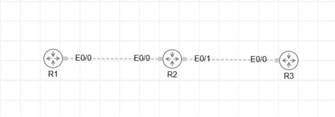

# はじめに
Static Natの構築について触れていきます

## Static Natとは?

## 設定方法

###　前提条件



| ノード | インターフェース | 役割     | IPアドレス         |
| --- | -------- | ------ | -------------- |
| R1  | Eth0/0   | 内部LAN側 | 192.168.1.1/24 |
| R2  | Eth0/0   | 内部LAN側 | 192.168.1.2/24 |
| R2  | Eth0/1   | 外部WAN側 | 203.0.113.1/24 |
| R3  | Eth0/0   | 外部サーバー | 203.0.113.3/24 |

- インターフェースは無料版だとGi0/0とかにリネームできないことが判明したためイーサネットじゃないけどEthを採用する羽目になりました。かなしい

### IPの設定
IPを指定する

```bath
; IPアドレスを指定
enable
configure terminal
interface eth0/0
 ip address 192.168.1.1 255.255.255.0
 no shutdown
exit

```
