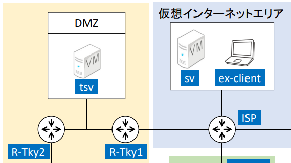

# ルーターの設定

## 要件

- tsv、R-Tky1、R-Tky2、ISPから構成
- R-Tky1とR-tky2の間にスイッチを配置してtsvを配置している

### ターミナル環境
- コマンドご入力によるDNS検索をしない
- timezoneをJSTに
- more表示の無効化
- 表示割込みに対する入力文字列補完
- 特権モードで常にアクセス

### ホスト名
| ルーター名   | コンソールパスワード | イネーブルパスワード |
|-------------|---------------------|----------------------|
| R‐Tky1      | cisco               | cisco                |
| R‐Tky2      | cisco               | cisco                |
| R‐Gnm       | cisco               | cisco                |

### インターフェース設定
#### 