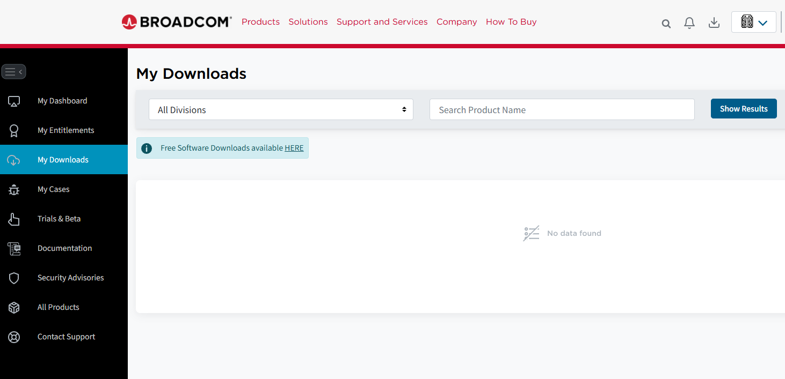
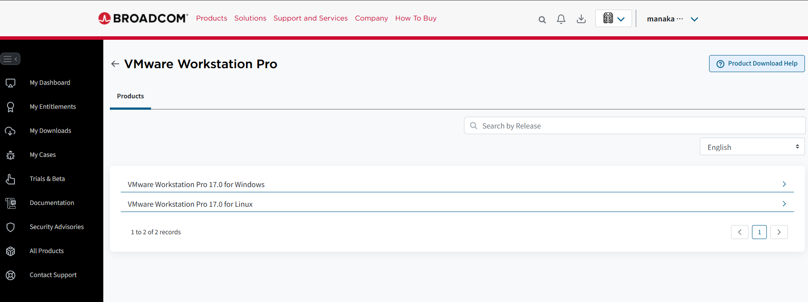
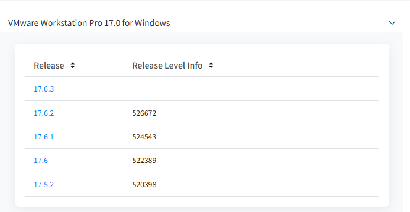
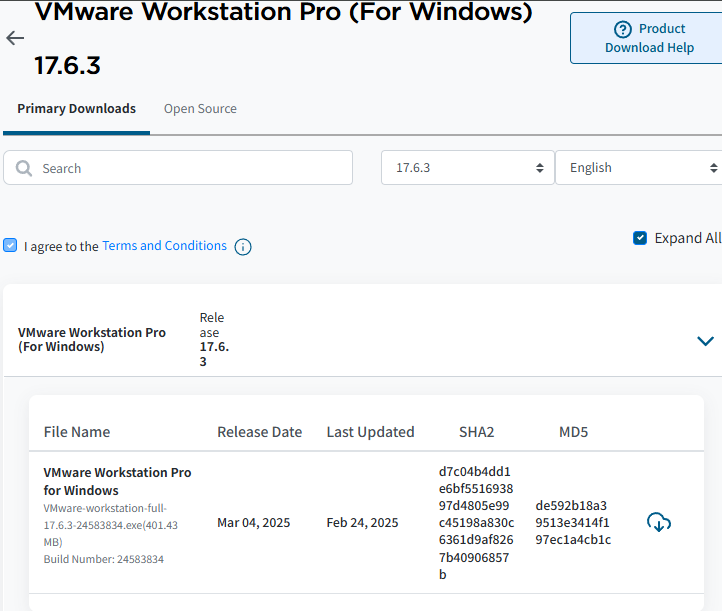
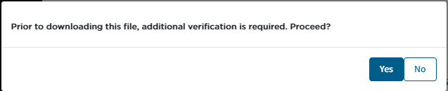
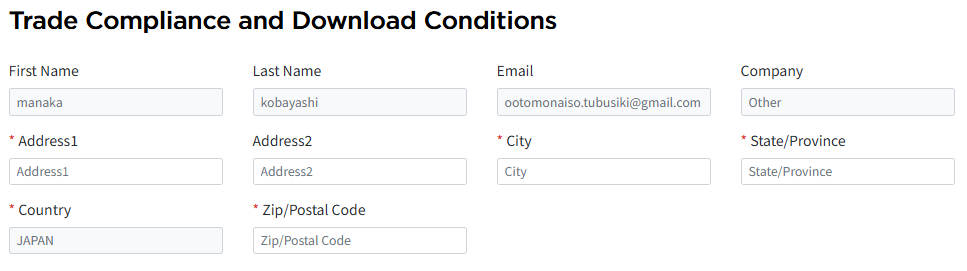

# VMWare Workstation Proをセットアップする

## VMWare Workstation Proのインストーラーのダウンロード

### 1. VMWareのページに
[VMWare Workstation](https://support.broadcom.com/group/ecx/productdownloads?subfamily=VMware+Workstation+Pro)にアクセスする。

### 2. BROADCOMアカウントを渋々作る
BROADCOMのアカウント持ってない人は[ここからBROADCOMアカウントを作成](https://profile.broadcom.com/web/registration)してからログイン。アカウント作成画面は別タブで開くと楽

### 3. インストーラーを探す

右のサイドメニューから**My Downloads**を選択し、検索ボックス下にある**Free Software Downloads available HERE**をクリック
下の方にある**VMWare Workstation Pro**を選択

### 4. お好みのOSを選ぶ

Windowsで使うならばWindows。Linuxで使うならLinuxのインストーラーを選択。今回はWindows使います

バージョンは大会環境、または最新の環境を使ってください。多分ここにあるのは安定リリースだと思います。今回は思考停止した状態で一番上のやつ選びました

### 5.ダウンロード

**I agree to theTerms and Conditions**にチェックを入れた後で、雲に下向き矢印がついてるのを押します

「のファイルをダウンロードする前に、追加の検証が必要です。続行しますか?」と書かれてるので「Yes」を選択

### 6.住所情報入れるターン

既に入力している場合は出てこない(と思われる)ページです。入力が完了して提出すると元のページにリダイレクトするのでもう一度ダウンロードボタン押してください

- 名前(FirstName、LastName)、Email、郵便番号(Zip/PostalCode)含む住所は一部自動入力されます
- 赤いアスタリスクがついているところは必須入力欄なので埋めといてください

## VMWare Workstation Proのインストール
### インストール手順
- インストーラーを起動します
- 