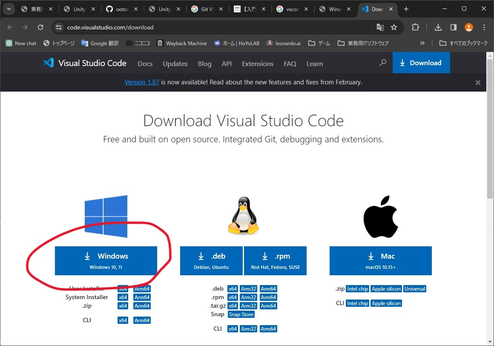

# 管理者権限なしでPythonを使う野望
管理者権限がない状態のPCではPythonのインストーラーを使ってインストールすることが地味に難しいので、今回はPythonの再頒布可能パッケージを使ってセットアップする方法をまとめます。

## 1.VSCodeのインストール


Windows版のインストーラーを入手します。日本語の相変わらずインストーラーがダウンロードフォルダにあるので開きます。このインストーラーはちゃんと日本語です。VSCodeはすでにセットアップ済みなので、ここでは簡単に手順だけ説明します。

1. 利用許諾は「同意する」を選択し、「次へ」をクリックします。
2. インストール先はデフォルトのままで構いません。
3. スタートメニューフォルダもそのまま「次へ」をクリックします。
4. 「デスクトップにアイコンを作成する」にチェックを入れて「次へ」。
5. 「インストール」を押して、終わったら「完了」をクリックします。

## 2.VSCodeの日本語化


左側のタイルマークをクリックして拡張機能の画面を開きます。
その画面の検索ボックスに`Japan`と入力し、赤丸でかこった言語パックを探してください。


インストールが終わるとVSCodeの右下にこの通知が来ます。青いボタンを押して、言語パックを適用させましょう

## 3.Pythonのパッケージのダウンロード

[Python公式サイト-ダウンロードページ](https://www.python.org/downloads/windows/)

上のリンクからダウンロードサイトに飛びます。


アクセスするとこのような画面が出てくると思います。


`Stable Releases`から`Python 3.12.4 - June 6, 2024`というバージョンを探します。`Download Windows embeddable package (64-bit)`というパッケージをダウンロードします。黄色い下線が入っている部分をクリックするとダウンロードが始まります。


ダウンロードできればダウンロードフォルダにあからさまにzipがおいてあります


エクスプローラーのPCから<mark>Local Disk(C:)</mark>を開いてこの中に<mark>Python3.12.4</mark>という名前のフォルダを作成します。


タスクバーにあるエクスプローラを右クリックして、そこに出てくる<mark>エクスプローラ</mark>と書かれた、赤丸でかこったところをクリックすると新しいエクスプローラが開きます。次の手順に進んでください。


新しく開いたエクスプローラで、先ほどダウンロードしたPythonのパッケージのzipファイルをダブルクリックして開き、<mark>Ctrl+A</mark>で全選択してください。


全選択したファイルを左クリックで握って、Python3.12.4フォルダにドラッグアンドドロップしてください。全てコピーされているのを確認したらVSCodeを開いてください。

## 4.VSCodeにPythonを認識させる

まず下準備として適当なところにフォルダとPythonのファイルを作成してください。  
作成したPythonのファイルの中に適当にprint文でも入れておいてください。

```python
print("こんにちは世界")