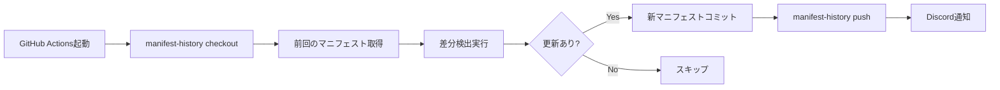

# 設計書: マニフェスト履歴管理ブランチ

## 概要

ドキュメント差分検出用のマニフェストファイル(`docs-manifest.yml`)を専用ブランチで管理することで、メインブランチの履歴をクリーンに保ち、更新履歴を独立して追跡可能にする。

## 目的

- メインブランチにマニフェスト更新コミットを混入させない
- ドキュメント更新履歴を独立したブランチで追跡
- CI/CDでの自動コミット・プッシュを簡素化

## 設計

### ブランチ構成

```
master/devlop (メインブランチ)
  ├── website/
  ├── script/
  └── .github/workflows/

docs-manifest-history (履歴管理専用ブランチ)
  └── docs-manifest.yml  ← ここだけ
```

### データフロー



## 実装仕様

### 1. ブランチ初期化

```bash
# 履歴管理専用ブランチを作成
git checkout --orphan docs-manifest-history
git rm -rf .
touch docs-manifest.yml
git add docs-manifest.yml
git commit -m "Initialize manifest history branch"
git push origin docs-manifest-history
```

### 2. GitHub Actions ワークフロー修正

#### 修正箇所: `.github/workflows/deploy.yml`

##### Step 1: マニフェストブランチのチェックアウト

```yaml
- name: Checkout manifest history branch
  uses: actions/checkout@v3
  with:
    ref: docs-manifest-history
    path: manifest-repo
    token: ${{ secrets.GITHUB_TOKEN }}
```

##### Step 2: 前回のマニフェストを取得

```yaml
- name: Copy previous manifest
  run: |
    if [ -f manifest-repo/docs-manifest.yml ]; then
      cp manifest-repo/docs-manifest.yml script/docs-manifest.yml
      echo "✅ 前回のマニフェストを取得しました"
    else
      echo "⚠️ マニフェストが存在しません（初回実行）"
    fi
```

##### Step 3: 差分検出（既存処理）

```yaml
- name: Run notify and vectorize script
  working-directory: script
  env:
    SITE_URL: 'https://ootomonaiso.github.io/ootomonaiso_strage/'
  run: node notify-and-vectorize.mjs
```

##### Step 4: 更新されたマニフェストをコミット・プッシュ

```yaml
- name: Commit and push manifest to history branch
  if: env.DOC_MSG != '' && env.DOC_MSG != '更新されたドキュメントはありません。'
  run: |
    cd manifest-repo
    cp ../script/docs-manifest.yml .

    git config user.name "github-actions[bot]"
    git config user.email "github-actions[bot]@users.noreply.github.com"

    git add docs-manifest.yml
    git commit -m "📝 Update manifest: $(date -u '+%Y-%m-%d %H:%M:%S UTC')" || echo "変更なし"
    git push origin docs-manifest-history

    echo "✅ マニフェストを docs-manifest-history ブランチに保存しました"
```

### 3. スクリプト修正

#### `notify-and-vectorize.mjs` の変更点

**削除する処理:**

```javascript
// この行を削除（Gitステージング不要になる）
function gitAddManifest() {
  // ...
}

// 呼び出しも削除
if (updatedFiles.length > 0 || deletedFiles.length > 0) {
  gitAddManifest(); // ← この行を削除
}
```

**理由**: GitHub Actionsで専用ブランチにコミットするため、スクリプト内でのgit addは不要。

## メリット

### 1. クリーンな履歴管理

- メインブランチにbotコミットが混入しない
- Pull Requestレビュー時にマニフェスト変更が邪魔にならない

### 2. 独立した追跡

```bash
# マニフェスト更新履歴を確認
git log docs-manifest-history --oneline

# 特定日時のマニフェストを取得
git show docs-manifest-history@{2026-02-01}:docs-manifest.yml
```

### 3. CI/CDの簡素化

- ブランチ保護ルールの影響を受けない
- 自動コミット・プッシュの権限管理が容易

### 4. 柔軟なロールバック

```bash
# 前回のマニフェストに戻す
git checkout docs-manifest-history~1 -- docs-manifest.yml
```

## デメリットと対策

| デメリット             | 対策                                 |
| ---------------------- | ------------------------------------ |
| ブランチ管理が複雑化   | READMEに明記、自動化で隠蔽           |
| 初回セットアップが必要 | 初期化スクリプト提供                 |
| 履歴ブランチの容量増加 | 定期的に古い履歴を削除（オプション） |

## セキュリティ考慮事項

### GITHUB_TOKEN の権限

```yaml
permissions:
  contents: write # ブランチへのプッシュに必要
```

### ブランチ保護設定

`docs-manifest-history` ブランチには保護ルールを**適用しない**（自動プッシュを許可するため）。

## 運用

### 初回デプロイ手順

1. ローカルで履歴ブランチを作成してプッシュ
2. ワークフローファイルを更新
3. `notify-and-vectorize.mjs` から `gitAddManifest()` を削除
4. テストデプロイを実行して動作確認

### 日常運用

- 開発者は何も意識する必要なし
- GitHub Actionsが自動でマニフェストを更新

### トラブルシューティング

```bash
# マニフェストブランチが壊れた場合
git push origin --delete docs-manifest-history
# 再度初期化手順を実行
```

## テスト計画

### テストケース

1. **初回実行**: マニフェストが存在しない状態
2. **差分なし**: 前回と同一の状態
3. **差分あり**: ドキュメントが更新された場合
4. **削除**: ドキュメントが削除された場合

### 期待動作

- 全てのケースでエラーなく完了
- Discord通知が適切に送信される
- `docs-manifest-history` ブランチが正しく更新される

## マイグレーション手順

### Phase 1: ブランチ作成

```bash
cd e:\00code\ootomonaiso_strage
git checkout --orphan docs-manifest-history
git rm -rf .
echo "# Manifest History Branch" > README.md
touch docs-manifest.yml
git add .
git commit -m "Initialize manifest history branch"
git push origin docs-manifest-history
git checkout devlop
```

### Phase 2: ワークフロー更新

- `.github/workflows/deploy.yml` を修正
- コミット後にPull Request作成

### Phase 3: スクリプト修正

- `notify-and-vectorize.mjs` から `gitAddManifest()` 削除

### Phase 4: 動作確認

- テストデプロイを実行
- Discord通知を確認
- マニフェストブランチを確認

## 関連ドキュメント

- [GitHub Actions: actions/checkout](https://github.com/actions/checkout)
- [Git: Orphan Branches](https://git-scm.com/docs/git-checkout#Documentation/git-checkout.txt---orphanltnewbranchgt)
- [Discord Webhook API](https://discord.com/developers/docs/resources/webhook)

## 変更履歴

- 2026-02-05: 初版作成
