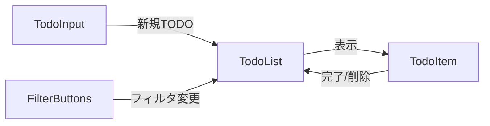

# cc-sdd：GitHub Copilotで仕様駆動開発を始める

AIコーディングで「デグレ地獄」に陥った経験はないだろうか。AIに指示を出しても、期待と違うコードが生成される。修正を依頼すると、前の機能が壊れる。この繰り返しで、結局自分で書いた方が早かったという結末。

その原因は「仕様が曖昧だから」だ。AIに明確な仕様を伝えられないと、AIは一般的な実装例を返すだけ。プロジェクト固有の要件は理解できない。

**cc-sdd** は、この問題を解決する仕様駆動開発ツール。要件定義→設計→タスク分解→実装という流れを体系化し、GitHub Copilot を含む8つのAIツールで使える。

## cc-sddとは

cc-sddは、Kiro IDE の仕様駆動開発手法をオープンソースで再現したツール。「仕様をAIに明確に伝える」ことで、AIが正確な実装をできるようにする。

### 特徴

- **仕様ファースト** - 実装前に要件・設計を固める
- **開発過程の可視化** - 各フェーズの成果物が `.kiro/specs/` に保存
- **プロジェクトメモリ** - AIがアーキテクチャ、パターン、基準を記憶
- **8つのAI対応** - GitHub Copilot、Claude Code、Cursor、Gemini CLI、Codex CLI、Qwen Code、OpenCode、Windsurf
- **13言語対応** - 日本語、英語、中国語など
- **カスタマイズ可能** - チーム独自のドキュメント形式に対応

### なぜデグレが防げるのか

従来のバイブコーディング：

```
曖昧な指示 → AIが推測で実装 → デグレ発生 → 修正依頼 → さらにデグレ → 地獄
```

cc-sddを使った場合：

```
要件明文化 → 設計承認 → タスク分解 → AIが仕様通りに実装 → デグレなし
```

つまり、「何を作るか」を人間が明確に決めてから、「どう作るか」をAIに任せる。これで、AIは迷わず正確な実装ができる。

## インストール

### 前提条件

- Node.js がインストールされていること
- GitHub Copilot が使える環境

### セットアップ

プロジェクトのルートディレクトリで以下を実行：

```bash
npx cc-sdd@latest --copilot --lang ja
```

実行すると、以下が生成される：

- `.github/prompts/` - 11個のスラッシュコマンド
- `.kiro/settings/` - テンプレートとルール（25ファイル）
- `AGENTS.md` - プロジェクトメモリ

30秒でセットアップ完了。これで GitHub Copilot Chat で `/kiro-*` コマンドが使えるようになる。

### 生成されるコマンド一覧

| コマンド                  | 説明                                 |
| ------------------------- | ------------------------------------ |
| `/kiro-spec-init`         | 新しい仕様を初期化                   |
| `/kiro-spec-requirements` | 要件定義書を生成（EARS形式）         |
| `/kiro-spec-design`       | 設計書を生成（アーキテクチャ図含む） |
| `/kiro-spec-tasks`        | 実装タスクを生成（依存関係付き）     |
| `/kiro-spec-impl`         | タスクを実装（TDD手法）              |
| `/kiro-spec-status`       | 進捗状況を確認                       |
| `/kiro-steering`          | プロジェクト知識を管理               |
| `/kiro-validate-gap`      | 要件と既存コードのギャップ分析       |
| `/kiro-validate-design`   | 設計書をレビュー                     |
| `/kiro-validate-impl`     | 実装を検証                           |
| `/kiro-steering-custom`   | カスタムステアリング作成             |

## 基本ワークフロー

### 新規機能開発の場合

```bash
# 1. 仕様を初期化
/kiro-spec-init 写真アルバム機能（アップロード、タグ付け、共有）

# 2. 要件定義書を生成
/kiro-spec-requirements photo-albums

# 3. 設計書を生成（-yで自動承認）
/kiro-spec-design photo-albums -y

# 4. タスクに分解
/kiro-spec-tasks photo-albums -y

# 5. タスクを実装
/kiro-spec-impl photo-albums task-001
/kiro-spec-impl photo-albums task-002

# 6. 進捗確認
/kiro-spec-status photo-albums
```

### 既存プロジェクトに機能追加する場合

```bash
# 1. プロジェクト知識を生成（初回のみ）
/kiro-steering

# 2. 仕様を初期化
/kiro-spec-init 新機能の説明

# 3. ギャップ分析（省略可）
/kiro-validate-gap feature-name

# 4. 要件定義
/kiro-spec-requirements feature-name

# 5. 設計
/kiro-spec-design feature-name

# 6. 設計レビュー（省略可）
/kiro-validate-design feature-name

# 7. タスク分解
/kiro-spec-tasks feature-name

# 8. 実装
/kiro-spec-impl feature-name

# 9. 実装検証（省略可）
/kiro-validate-impl feature-name
```

## 各コマンドの詳細

### 1. spec-init：仕様の初期化

**使い方**：

```
/kiro-spec-init <機能の説明>
```

**例**：

```
/kiro-spec-init ユーザー認証機能（メール認証、パスワードリセット、2FA対応）
```

**生成されるもの**：

- `.kiro/specs/user-authentication/` ディレクトリ
- `spec.json` - メタデータ
- `requirements-init.md` - 初期要件テンプレート

**ポイント**：

- 機能の説明は具体的に書く
- 主要な機能を箇条書きで含める
- 技術的な制約があれば記載

### 2. spec-requirements：要件定義

**使い方**：

```
/kiro-spec-requirements <機能名>
```

**生成されるもの**：

- `requirements.md` - EARS形式の要件定義書

**EARS形式とは**：
Easy Approach to Requirements Syntax の略。要件を以下の形式で記述：

```
WHEN [トリガー条件]
IF [前提条件]
THEN システムは [期待される動作]
```

**例**：

```markdown
## 要件-001: メール認証

WHEN ユーザーが新規登録フォームを送信した場合
IF メールアドレスが有効な形式である
THEN システムは確認メールを送信し、確認待ち状態にする
```

**ポイント**：

- 機能要件だけでなく、非機能要件（パフォーマンス、セキュリティ）も含める
- 曖昧な表現を避ける
- 具体的な数値を入れる（例：レスポンス時間は2秒以内）

### 3. spec-design：設計書作成

**使い方**：

```
/kiro-spec-design <機能名> [-y]
```

**オプション**：

- `-y`: 自動承認（レビューをスキップ）

**生成されるもの**：

- `design.md` - 技術設計書

**含まれる内容**：

1. アーキテクチャ概要
2. システムフロー図（Mermaid形式）
3. データモデル
4. API設計
5. セキュリティ設計
6. エラーハンドリング
7. テスト戦略

**ポイント**：

- 初めは `-y` なしで実行し、対話的にレビュー
- 設計に問題があれば、この段階で修正
- Mermaid図は自動生成されるので確認必須

### 4. spec-tasks：タスク分解

**使い方**：

```
/kiro-spec-tasks <機能名> [-y]
```

**生成されるもの**：

- `tasks.md` - 実装タスク一覧（依存関係付き）

**タスクの構成**：

```markdown
### Task-001: データベーススキーマ作成

- 優先度: 高
- 依存: なし
- 見積: 30分

詳細説明...
```

**ポイント**：

- タスクは並列実行可能な単位に分解される
- 依存関係が明示されるので、実装順序が分かる
- 各タスクには見積時間が含まれる

### 5. spec-impl：実装

**使い方**：

```
/kiro-spec-impl <機能名> [タスク番号]
```

**例**：

```
# 全タスクを実装
/kiro-spec-impl user-authentication

# 特定のタスクを実装
/kiro-spec-impl user-authentication task-001 task-003
```

**実装の流れ**：

1. タスクの詳細を読み込む
2. TDD手法でテストを先に書く
3. テストをパスする実装を書く
4. リファクタリング
5. 完了報告

**ポイント**：

- TDD（テスト駆動開発）で実装される
- 依存関係を考慮して順番に実装
- 各タスク完了後、次のタスクに進む

### 6. spec-status：進捗確認

**使い方**：

```
/kiro-spec-status [機能名]
```

**表示される情報**：

- 要件定義：完了 / 未完了
- 設計書：完了 / 未完了
- タスク進捗：3/12完了
- 最後の更新日時

**ポイント**：

- 引数なしで全仕様の一覧表示
- 機能名指定で詳細表示

### 7. steering：プロジェクト知識管理

**使い方**：

```
/kiro-steering
```

**生成されるもの**：

- `.kiro/steering/product.md` - プロダクト概要
- `.kiro/steering/tech.md` - 技術スタック、アーキテクチャ
- `.kiro/steering/structure.md` - ディレクトリ構造

**ポイント**：

- 既存プロジェクトでは初回必須
- AIがプロジェクトの文脈を理解する基盤
- 定期的に更新（月1回推奨）

### 検証コマンド

検証コマンドは省略可能だが、品質を担保するために推奨：

**validate-gap**：要件と既存コードのギャップを分析

- 既存機能との重複を発見
- 不足している機能を指摘
- リファクタリングの必要性を判断

**validate-design**：設計書をレビュー

- アーキテクチャの一貫性
- パフォーマンスの問題
- セキュリティの懸念

**validate-impl**：実装を検証

- 要件を満たしているか
- 設計に準拠しているか
- テストカバレッジは十分か

## 実践例：TODOアプリの実装

実際にcc-sddを使って、TODOアプリを作ってみる。

### ステップ1：仕様初期化

```
/kiro-spec-init TODOアプリ（作成、完了、削除、フィルタ機能）
```

生成される機能名：`todo-app`

### ステップ2：要件定義

```
/kiro-spec-requirements todo-app
```

生成される要件の例：

```markdown
## 要件-001: TODO作成

WHEN ユーザーが入力フォームにタイトルを入力して「追加」ボタンを押した場合
IF タイトルが空でない
THEN システムは新しいTODOを作成し、リストの最上部に表示する

## 要件-002: TODO完了

WHEN ユーザーがTODOのチェックボックスをクリックした場合
THEN システムはTODOの完了状態をトグルし、完了したTODOには打ち消し線を表示する
```

### ステップ3：設計

```
/kiro-spec-design todo-app -y
```

生成される設計の例：

````markdown
## アーキテクチャ

### コンポーネント構成

- TodoList: メインコンテナ
- TodoItem: 個別TODO表示
- TodoInput: 入力フォーム
- FilterButtons: フィルタボタン

### データフロー


````

### 状態管理

- useState でローカル状態管理
- todos: TODO配列
- filter: 'all' | 'active' | 'completed'

```

### ステップ4：タスク分解

```

/kiro-spec-tasks todo-app -y

````

生成されるタスク：
```markdown
### Task-001: プロジェクトセットアップ
依存: なし
見積: 10分

### Task-002: TodoItemコンポーネント作成
依存: task-001
見積: 20分

### Task-003: TodoListコンポーネント作成
依存: task-002
見積: 30分

### Task-004: TodoInputコンポーネント作成
依存: task-001
見積: 20分

### Task-005: フィルタ機能実装
依存: task-003
見積: 25分
````

### ステップ5：実装

```
/kiro-spec-impl todo-app
```

AIが順番に実装：

1. セットアップ（Create React App）
2. TodoItemコンポーネント（テスト付き）
3. TodoListコンポーネント（テスト付き）
4. TodoInputコンポーネント（テスト付き）
5. フィルタ機能（テスト付き）

### ステップ6：完成

約1時間半で、テスト付きのTODOアプリが完成。

従来の方法だと：

- 曖昧な指示でAIに作らせる
- 期待と違う実装になる
- 修正依頼を繰り返す
- 結局3時間以上かかる

cc-sddを使うと：

- 明確な仕様をもとに実装
- 一発で期待通りの実装
- テストも自動生成
- 1時間半で完成

## カスタマイズ

### テンプレートのカスタマイズ

チーム独自のドキュメント形式に合わせられる。

`.kiro/settings/templates/` を編集：

```bash
.kiro/settings/templates/
├── specs/
│   ├── requirements.md  # 要件定義書のテンプレート
│   ├── design.md        # 設計書のテンプレート
│   └── tasks.md         # タスクのテンプレート
└── steering/
    ├── product.md       # プロダクト概要
    ├── tech.md          # 技術スタック
    └── structure.md     # ディレクトリ構造
```

### カスタマイズ例1：PRD形式の要件定義

`requirements.md` を編集：

```markdown
# {{FEATURE_NAME}} - Product Requirements Document

## 1. 目的

## 2. ターゲットユーザー

## 3. ユーザーストーリー

## 4. 機能要件

## 5. 非機能要件

## 6. 制約事項

## 7. 成功指標
```

### カスタマイズ例2：JIRA連携

`tasks.md` に JIRAのチケット番号を追加：

```markdown
### Task-{{TASK_NUMBER}}: {{TASK_TITLE}}

- JIRA: {{PROJECT_KEY}}-{{TICKET_NUMBER}}
- 優先度: {{PRIORITY}}
- 見積: {{ESTIMATE}}
```

### カスタマイズ例3：フロントエンド特化設計書

`design.md` にコンポーネント設計を追加：

```markdown
## コンポーネント設計

### {{COMPONENT_NAME}}

- Props:
- State:
- Hooks:
- イベントハンドラ:
```

## メリットとデメリット

### メリット

**1. デグレが激減**

- 仕様が明確なので、AIが迷わない
- 実装前に設計レビューできる
- テスト駆動なのでバグが少ない

**2. 開発時間の短縮**

- 実装フェーズは60%短縮
- ボイラープレートは自動生成
- テストも自動生成

**3. ドキュメントが自動生成**

- 要件定義書、設計書、タスク
- 常に最新の状態
- チーム全体で共有可能

**4. 複数AIの協業**

- GitHub Copilot のリミットに達したら Gemini に切り替え
- 仕様ファイルという共通言語があるから可能
- コスト最適化できる

**5. チーム開発に強い**

- テンプレートを統一すれば、全員が同じ形式
- プロジェクトメモリでオンボーディング容易
- レビュープロセスが明確

### デメリット

**1. 学習コスト**

- コマンドを覚える必要がある
- ワークフローに慣れるまで時間がかかる
- 初回は手間に感じる

**2. 小規模には重い**

- 1ファイルの修正には大げさ
- プロトタイプ段階では面倒
- 簡単な機能には向かない

**3. 設計フェーズは短縮できない**

- 要件定義、設計は人間がやる
- 考える時間は変わらない
- 急ぎの場合は従来の方法が速い

**4. テンプレート整備が必要**

- チームに合わせたカスタマイズが必要
- 初期設定に時間がかかる
- 定期的なメンテナンスが必要

## 使い分けのコツ

### cc-sddを使うべき場面

- 中規模以上の機能開発
- 既存プロジェクトへの機能追加
- チーム開発
- 長期運用するプロダクト
- 品質が重要な場面

### cc-sddを使わない方が良い場面

- プロトタイプ作成
- 1ファイルの修正
- 緊急の修正
- 使い捨てのスクリプト
- 実験的なコード

## トラブルシューティング

### コマンドが表示されない

**原因**：GitHub Copilot が `.github/prompts/` を認識していない

**解決策**：

1. VS Code を再起動
2. GitHub Copilot の拡張機能を再読み込み
3. `.github/prompts/` のパーミッションを確認

### 日本語が文字化けする

**原因**：ファイルのエンコーディングが UTF-8 でない

**解決策**：

```bash
# 再インストール時にエンコーディング指定
npx cc-sdd@latest --copilot --lang ja --encoding utf-8
```

### 生成される仕様が期待と違う

**原因**：

- プロジェクトメモリが古い
- テンプレートが適切でない

**解決策**：

1. `/kiro-steering` を再実行してプロジェクト知識を更新
2. `.kiro/settings/templates/` をカスタマイズ
3. より具体的な説明を与える

### タスクの依存関係が間違っている

**原因**：設計書の情報が不足

**解決策**：

1. `design.md` を手動で修正
2. `/kiro-spec-tasks` を再実行

## 参考リンク

- [cc-sdd GitHub](https://github.com/gotalab/cc-sdd)
- [公式ドキュメント（英語）](https://github.com/gotalab/cc-sdd/blob/main/docs/guides/command-reference.md)
- [公式ドキュメント（日本語）](https://github.com/gotalab/cc-sdd/blob/main/docs/guides/command-reference_ja.md)
- [カスタマイズガイド](https://github.com/gotalab/cc-sdd/blob/main/docs/guides/customization-guide.md)
- [バイブコーディングという地獄](https://zenn.dev/fugafuga/articles/9f999869812c17) - 実践例
- [Kiroの仕様書駆動開発プロセスをClaude Codeで徹底的に再現した](https://zenn.dev/gotalab/articles/3db0621ce3d6d2)

## まとめ

cc-sddは、AIコーディングにおける「デグレ地獄」から脱出するための強力なツール。

**重要なポイント**：

1. 仕様を明確にすることが、AIコーディング成功の鍵
2. 要件定義→設計→タスク分解→実装の流れを守る
3. 人間が「何を作るか」を決め、AIが「どう作るか」を実装
4. プロジェクトメモリで、AIに文脈を理解させる
5. テンプレートをカスタマイズして、チームに合わせる

AIに全てを任せるのではなく、人間とAIの適切な役割分担。これが、cc-sddが提案する AI コーディングの未来だ。

---

**2026年2月3日 記**

このガイドは、実際にcc-sddをセットアップして使ってみた経験をもとに書いた。ツールは日々進化しているので、最新情報は公式ドキュメントを参照してほしい。

cc-sddを使えば、「バイブコーディングにおける人間による仕様決定の重要性」を実践できる。仕様駆動開発は、AIコーディング時代の標準になっていくだろう。
